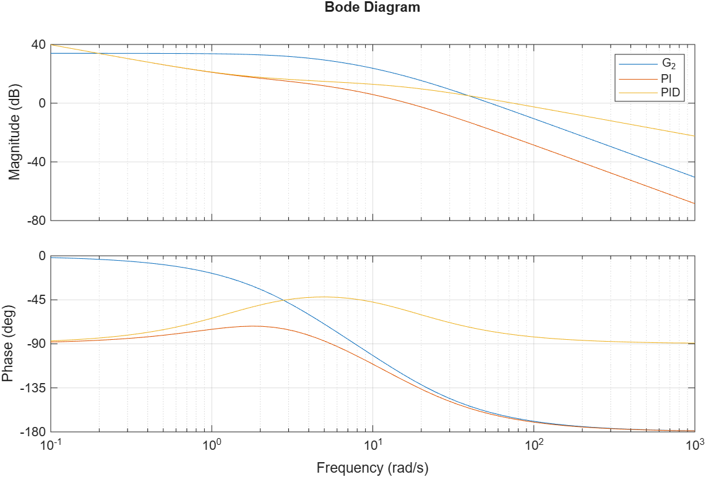
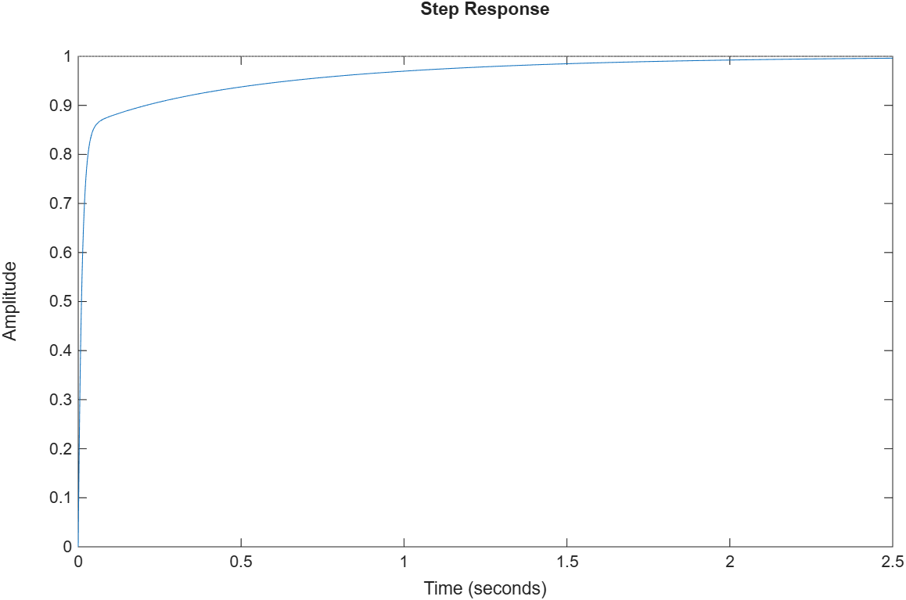

# PID Controller Design via Bode and Nyquist Analysis

## 📌 Overview
This repository contains a comprehensive frequency-domain analysis and control design project. The objective is to evaluate open-loop and closed-loop system stability using the **Nyquist Criterion** and to design PD, PI, and PID controllers using **Bode Plots** to meet strict transient and steady-state specifications.

## 🛠️ Tools & Technologies
* **MATLAB** (Control System Toolbox)
* **Frequency-Domain Analysis:** Bode Plots, Nyquist Diagrams, Gain Margin (GM), Phase Margin (PM).
* **Controller Design:** Proportional-Integral-Derivative (PID) tuning, steady-state error analysis, magnitude attenuation, and phase-lead injection.

## 🚀 Key Methodologies & Results

### 1. Stability Analysis (Nyquist Criterion)
* Evaluated system stability using the Cauchy argument principle ($Z = N + P$).
* Analyzed polar plots to determine the number of encirclements ($N$) around the critical point $(-1, 0)$.
* Identified Right-Half Plane (RHP) poles in closed-loop systems by mapping open-loop poles ($P$) and crossover points.

### 2. PD Controller Design (Phase-Lead)
* Designed a Proportional-Derivative ($C_{PD}(s) = K_p + K_d s$) controller to improve transient response.
* Positioned the controller's zero near the gain crossover frequency ($\omega_{cg}$) to inject phase advance.
* **Trade-off Analysis:** Evaluated multiple zero locations (from $2$ rad/s to $16$ rad/s) to find the optimal balance between Maximum Overshoot ($UP$) and Settling Time ($t_s$). The optimal zero was placed at $\omega = 5$ rad/s.

### 3. PI Controller Design (Magnitude Attenuation)
* Designed a Proportional-Integral ($C_{PI}(s) = K_p + K_i/s$) controller to eliminate steady-state error ($e_{ss} \le 2\%$) for a step input.
* Reduced the open-loop magnitude by $-18$ dB to shift the crossover frequency to a lower range, significantly increasing the Phase Margin to approximately $55^\circ$.
* Met the transient constraint of $UP \le 20\%$ while keeping $t_s \approx 1.05$ s.

### 4. Final PID Integration
* Combined the PI and PD actions into a final PID architecture ($C_{PID} = C_{PI} \times C_{PD}$).
* The derivative zero addition created a $-90^\circ$ high-frequency asymptote, resulting in an infinite Gain Margin and a Phase Margin of $\approx 90^\circ$.
* **Final Performance:** The closed-loop step response achieved **$0\%$ Overshoot** and a settling time of **$1.29$ s**, fully satisfying the project constraints with high robustness.

## 📊 Visual Results

Below is the frequency-domain comparison showing the uncompensated plant ($G_2$), the PI-compensated system, and the final PID-compensated system. Notice how the PID controller shifts the phase asymptote to $-90^\circ$, ensuring infinite Gain Margin.

The time-domain validation confirms the success of the frequency-domain design, showing a critically damped step response with exactly $0\%$ overshoot and zero steady-state error.

## 💻 How to Run
1. Clone this repository.
2. Open the `src/` directory in MATLAB.
3. Run the main scripts to generate the transfer functions, Bode/Nyquist plots, and step response simulations.
