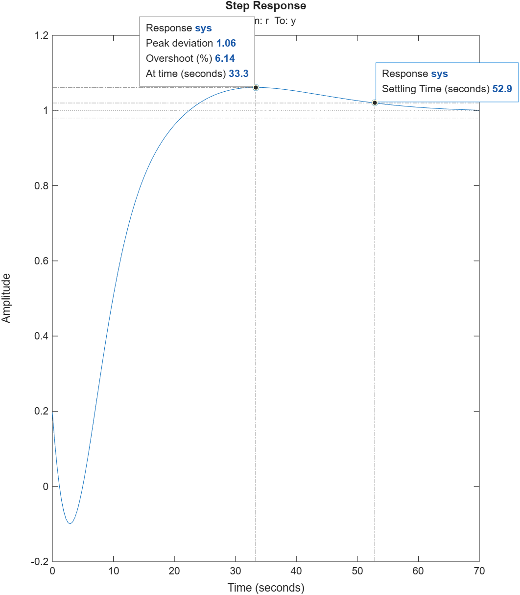

# Root Locus Analysis and PID Controller Design

## 📌 Overview
This project focuses on the analysis and design of feedback control systems using the Root Locus method. The objective was to design proportional-derivative (PD) and proportional-integral (PI) controllers to meet specific transient response requirements, such as settling time and maximum overshoot.

## 🛠️ Tools & Technologies
* **MATLAB** (Control System Toolbox)
* **Mathematical Modeling:** Transfer functions, Padé approximations, Continuous-to-Discrete conversions (c2d).

## 🚀 Key Implementations
1. **Stability Analysis:** Evaluated the stability margins of open-loop transfer functions based on critical gain limits.
2. **PD Controller Design:** Tuned $K_p$ and $K_d$ to achieve the specified overshoot and settling time.
3. **PI/PID Integration:** Implemented derivative action to reduce overshoot by half while maintaining the settling time, compensating for delays using a 2nd-order Padé approximation.

## 📊 Results

## 💻 How to Run
1. Clone this repository.
2. Open the `src/` folder in MATLAB.
3. Run `main_analysis.m` to generate the Root Locus plots and Step Responses.
